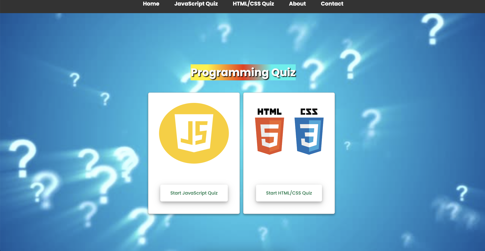

# Programming Quiz!

Welcome to the JavaScript and HTML/CSS Fundamentals Quiz! This quiz is designed to test your knowledge of core JavaScript and HTML/CSS concepts, syntax, and best practices. Whether you're a beginner looking to reinforce your understanding or an experienced developer seeking to sharpen your skills, this quiz offers a range of questions to challenge your JavaScript and HTML/CSS expertise.

[View Shoppers Stop Github pages](https://github.com/mehatabpathan/quiz-game "View shoppers stop Github pages")

[View shoppers Stop Live Website](https://mehatabpathan.github.io/quiz-game/ "View Shoppers stop Live Website")

## User Stories
- As a user, I can track my quiz progress and see my scores over time.
- As a user, I want to browse and select quizzes by category so that I can choose quizzes that match my interests or skill level.
- As a user, I want to see a list of available questions in a quiz so that I can prepare and understand the scope of the quiz.
- As a user,  I can answer questions and test my knowledge.
- As a user, I want to answer multiple-choice questions so that I can provide my answers for evaluation.
- As a user, I want to see my progress within the quiz so that I can gauge how much is left and manage my time effectively.
- As a user, I want to review and change my answers before submitting the quiz so that I can make sure I've answered to the best of my ability.
- As a user, I want to receive immediate feedback on my answers so that I can understand which questions I answered correctly and incorrectly.

## Features
### Start Page

Landing page of Programming Quiz. It displays two start button with javascript and html/css when pressed that start showing the rules box if we press continue it will take us to quiz box once we are done with quiz it will display the score card.

#### Set Of Rules

---
### Quiz Box

If we press javascript questions it shows javascript quiz else it shows html/css questions .It shows all the question from 1 to 10 .

#### Score Card
This shows the result of the score.

## Testing
### How I tested
| What test was completed | Passed? Y(yes)/N(no) |
|:-----------------------:|:-------------------:|
| Responsiveness on Samsung A41 Phone Portrait | Y |
| Responsiveness on Samsung A41 Phone Landscape | Y |
| Responsiveness on Teclast Tablet Portrait | Y |
| Responsiveness on Teclast Tablet Lanscape | Y |
| Responsive behaviours on over 12 mobile device settings in chrome dev tools | Y |
| Responsiveness om desktop Google chrome 1920px x 1080px | Y |
| Responsiveness om desktop Google chrome 5120px x 1440px| Y |
| Responsiveness om desktop Google chrome 2560px by 1440px | Y |
| Google chrome lighthouse | Y |
| HTML Validation All | Y |
| Contrast checker | Y |
| CSS Validation | Y |
| JavaScript Validation script.js | Y |
| JavaScript Validation jsquestions.js | Y |
| JavaScript Validation htmlcssquestions.js | Y |

### bugs encountered

| Bugs/Issues Encountered          | How problem was fixed                               | Fixed Y(yes)/N(no) |
|:--------------------------------:|:---------------------------------------------------:|:------------------:|
| Play button was not loading quiz | was a missing bracket that was deleted accidentally | Y |
| Questions Were Not Displaying | Was a typo in json file name in script.js | Y |
| Mobile device landscape not displaying as intended. Author links and title appear in odd fashion on certian resolutions | Ongoing issue tried diffrent css finally found one that works although going to keep my script for the set resolutions to rotate back as it is best experiance. still | Y |
| Author Links appearing underneath other elements at certain resolutions | Removed Z index | Y |
| How to div was displaying upon load | Added hidden class to it to hide it on load | Y |
| Responsive css attempt of landscape mode set everything in an od skew to left | Removed the css that caused issue | Y |
| Over responsive footer | There was a buggy CSS code using footer and anchor tags I removed it | Y |
| Font was difficult to read for some users | Replaced font with a more user friendly font | Y |
| Hover effect remains active after selecting an answer and next question is loading | Added media querry to remove hover effect on touch devices | Y |
| Hover effect disabled on all devices | Added missing media querry to the css | Y |

---

## Validation testing
### CSS
- checked with [W3 CSS Validator](https://jigsaw.w3.org/css-validator/validator) No CSS issues

### HTML
- checked with [W3 HTML Validator](/assets/images/htmlvalidationss.png) No HTML validation issues found

**Script.js**

**jsquestions.js**

**htmlcssquestions.js**

### Contrast
- Checked all pages with [A11Y contrast checker](https://color.a11y.com/) Any contrast issues?
- No automated color contrast issues found on the webpage tested

### JavaScript

All Scripts checked with [JSHint](https://jshint.com/)

| **Sctipt** | **Any Errors?** | **Warnings?** | Other note worthy comments |
|:----------:|:---------------:|:-------------:|:--------------------------:|
| script.js | No Errors | 5 Warnings all to do with compatibility | None |
| jsquestions.js | No Errors | no warnings| None |
| htmlcssquestions.js | No Errors | no warnings| None |

### Light House

## Deployment
Used GitHub Pages to bring the site to life [View The Site Here](https://mehatabpathan.github.io/quiz-game/)

## Technology used
- [HTML](https://www.w3schools.com/html/default.asp)
- [CSS](https://www.w3schools.com/css/default.asp)
- [JavaScript](https://www.w3schools.com/js/default.asp)
- [Json](https://www.w3schools.com/js/js_json_intro.asp)
- [Fontawesome](https://fontawesome.com/)
- [Google Fonts](https://fonts.google.com/)
- [Github](https://github.com/)
- [Git](https://git-scm.com/)
- [MS Paint](https://apps.microsoft.com/store/detail/paint/9PCFS5B6T72H)
- [Github Desktop App](https://desktop.github.com/)
- [ui.dev Am I Responsive](https://ui.dev/amiresponsive)

## Wireframes
### Start Page
[Start page wireframe](assets/images/startpagewf.png "view Start Page wire frame")

### Set of Rules
[Set of Rules wireframe](assets/images/ruleswf.png "view Set of Rules wire frame")

### Quiz Box
[Quiz Box wireframe](assets/images/quizboxwf.png " view Quiz Box wire frame")

### Score Card

## Credits
**Code related**
- [My project one](https://github.com/Danger0101/Meaningful_Careers_P1) for structure of this reademe file

**Other Notible Mentions**
- [W3Schools](https://www.w3schools.com/) for inspiration on the loading CSS for use on quiz page and to find out uses for all type of varriables and inspiration to the questions. Invaluable tool so much knowledge for freee its crazy.

- [My wife](https://www.twitch.tv/flame_121) who’s been supper supportive of this change in career for me and just being out right amazing we will get her into this one way or another I am sure.

- [Code Institute](https://codeinstitute.net/) for providing an excellent accelerated learning platform worth every penny.
