# Programming Quiz!

Welcome to the JavaScript and HTML/CSS Fundamentals Quiz! This quiz is designed to test your knowledge of core JavaScript and HTML/CSS concepts, syntax, and best practices. Whether you're a beginner looking to reinforce your understanding or an experienced developer seeking to sharpen your skills, this quiz offers a range of questions to challenge your JavaScript and HTML/CSS expertise.

[View Programming Quiz Github pages](https://github.com/mehatabpathan/quiz-game "View Programming Quiz Github pages")

[View Programming Quiz Live Website](https://mehatabpathan.github.io/quiz-game/ "View Programming Quiz Live Website")

## User Stories
- As a user, I want to navigate to different sections of the website so that I can choose the quiz I want to play.
    

Screenshots

    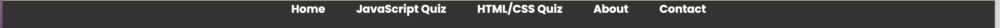
    

- As a user, I want to start a quiz so that I can test my programming knowledge.
- As a user, I want to see a list of available questions in a quiz so that I can prepare and understand the scope of the quiz.
- As a user, I want to receive clear instructions on how the quiz works so that I can understand the rules.
- As a user, I want to enter my name and email before starting the quiz so that I can be identified and receive my results.
    

Screenshots

    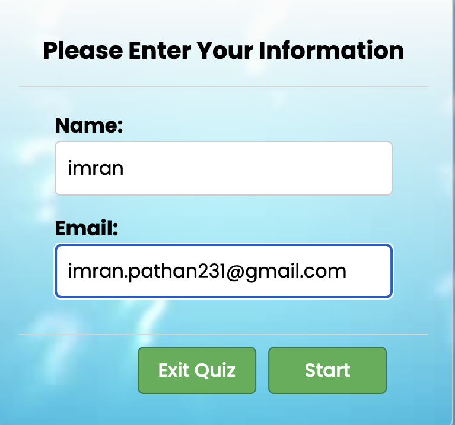
    

- As a user, I want to see my progress in the quiz so that I know how many questions are remaining.
- As a user, I want to see my final score at the end of the quiz so that I know how well I performed.
- As a user, I want to be able to replay the quiz so that I can try to improve my score.
    

Screenshots

    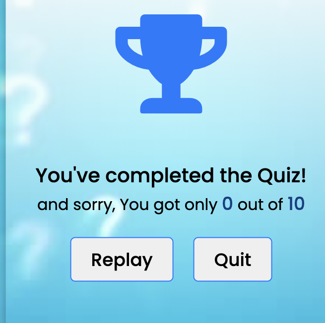
    

- As a user, I want to be able to quit the quiz at any time so that I can exit the game.
- As a user, I want the quiz to be visually appealing and easy to understand so that I can enjoy my experience.
    

Screenshots

    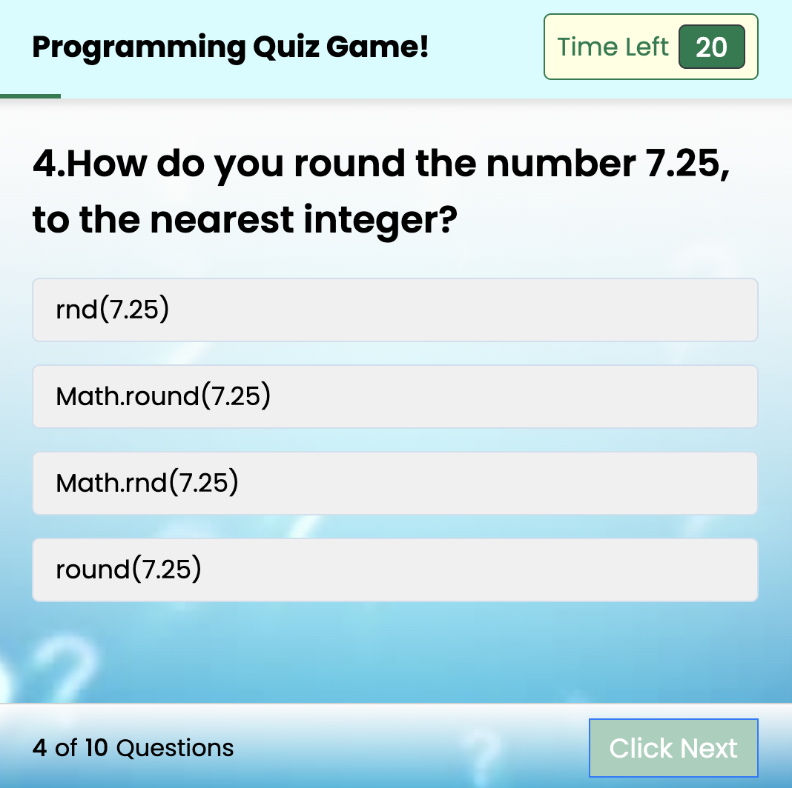
    
 
- As a user, I want the 404 page to be visible when i press the wrong url it should show the Error page.
    

Screenshots

    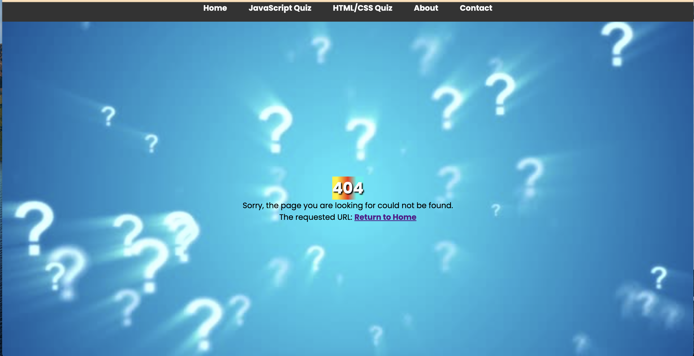
    

## Features
### Start Page

- Landing page of Programming Quiz. Home page with navigation links.
- Links to JavaScript Quiz, HTML/CSS Quiz, About, and Contact pages. 
- Start buttons for JavaScript Quiz and HTML/CSS Quiz.

#### Set Of Rules

- Display rules and instructions for the quiz.
- Inform users about the time limit per question, no option reselection, inability to exit during the quiz, and scoring system.

#### User Information Input

- Form to input user's name and email before starting the quiz.

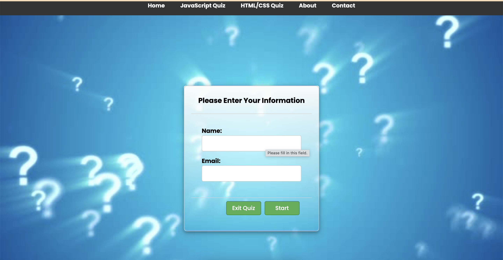

### Quiz Box

- Display quiz questions with multiple-choice options.
- Implement a 20-second timer for each question.
- Display current question number out of the total number of questions.

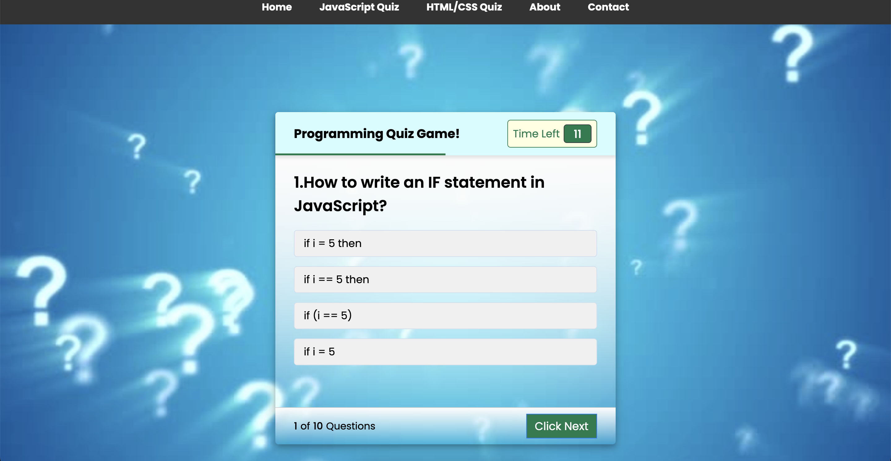

#### Score Card

- Display final score out of the total number of questions.
- Option to replay the quiz.

#### About page

- Users are encouraged to explore the quizzes. By mentioning that the quizzes help users learn new concepts, the content invites visitors to interact with the educational materials provided on the site.

#### Contact Page
 - The page provides clear instructions and feedback to the user. If there are any issues, suggestions, or questions, users are encouraged to reach out. The success message confirms to the user that their message has been successfully submitted.

#### 404 Page
- When a user accesses a non-existing URL on this website, this 404 error page will be displayed to them.

### Colour Scheme

[Website Colour Scheme](assets/images/coolors.png "coolors image")

The website uses bright and light colours using color gradient for more variety.Background image I used #03F2ED color and for buttons #087C4D is used.with opacity 1 and z-index is 1.

## Testing

### Testing user stories

1. As a user, I want to navigate to different sections of the website so that I can choose the quiz I want to play.

| **Feature**  | **Action**                  | **Expected Result**                                          | **Actual Result** |
| ------------ | --------------------------- | ------------------------------------------------------------ | ----------------- |
| Welcome Page | Click on the Home button  | It should show 2 quiz boxes as expected | Works as expected |

Screenshots

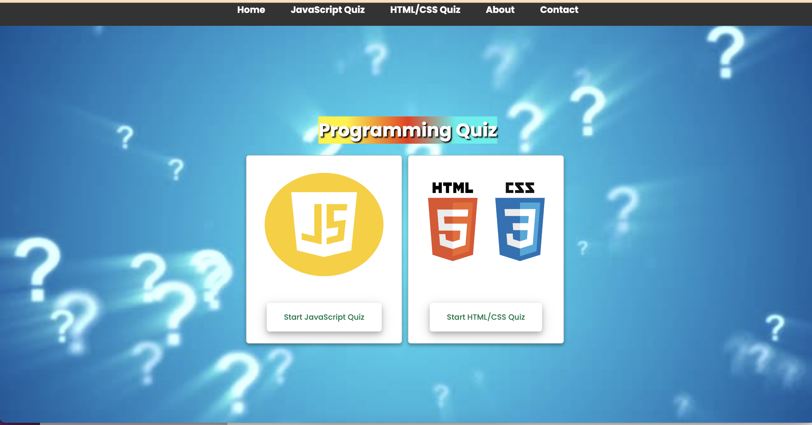

2. As a user, I want to enter my name and email before starting the quiz so that I can be identified and receive my results.

| **Feature**  | **Action**                  | **Expected Result**                                          | **Actual Result** |
| ------------ | --------------------------- | ------------------------------------------------------------ | ----------------- |
|  Enter you  Information details | we need to enter name and emailid and press enter | At the end of the score we will get the mail in our registered email | Works as expected |

Screenshots

3. As a user, I want to be able to replay the quiz so that I can try to improve my score.

| **Feature**  | **Action**                  | **Expected Result**                                          | **Actual Result** |
| ------------ | --------------------------- | ------------------------------------------------------------ | ----------------- |
|  Replay Button | when we press the button it should take to the quiz box | it takes to the quiz box we can replay the game again | Works as expected |

Screenshots

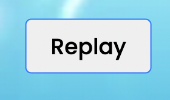

4. As a user, I want the 404 page to be visible when i press the wrong url it should show the Error page.

| **Feature**  | **Action**                  | **Expected Result**                                          | **Actual Result** |
| ------------ | --------------------------- | ------------------------------------------------------------ | ----------------- |
|  404 Error page | when we press the incorrect URL |It should show the error page | Works as expected |

Screenshots

### How I tested
| What test was completed | Passed? Y(yes)/N(no) |
|:-----------------------:|:-------------------:|
| Responsiveness on Samsung A41 Phone Portrait | Y |
| Responsiveness on Samsung A41 Phone Landscape | Y |
| Responsiveness on Teclast Tablet Portrait | Y |
| Responsiveness on Teclast Tablet Lanscape | Y |
| Responsive behaviours on over 12 mobile device settings in chrome dev tools | Y |
| Responsiveness om desktop Google chrome 1920px x 1080px | Y |
| Responsiveness om desktop Google chrome 5120px x 1440px| Y |
| Responsiveness om desktop Google chrome 2560px by 1440px | Y |
| Google chrome lighthouse | Y |
| HTML Validation All | Y |
| Contrast checker | Y |
| CSS Validation | Y |
| JavaScript Validation script.js | Y |
| JavaScript Validation jsquestions.js | Y |
| JavaScript Validation htmlcssquestions.js | Y |

### bugs encountered

| Bugs/Issues Encountered          | How problem was fixed                               | Fixed Y(yes)/N(no) |
|:--------------------------------:|:---------------------------------------------------:|:------------------:|
| Selected question string comparing was failing due to special chareters | Used element.textContent insted of Text | Y |
| Questions Were Not Displaying | Was a typo in  file name in script.js | Y |
| When deployed in github, images were not displaying | Was due to / infrom of image src path, removed it | Y |
| Author Links appearing underneath other elements at certain resolutions | Removed Z index | Y |
| How to div was displaying upon load | Added hidden class to it to hide it on load | Y |
| Responsive css attempt of landscape mode set everything in an od skew to left | Removed the css that caused issue | Y |
| Font was difficult to read for some users | Replaced font with a more user friendly font | Y |
| Hover effect remains active after selecting an answer and next question is loading | Added media querry to remove hover effect on touch devices | Y |
| Hover effect disabled on all devices | Added missing media querry to the css | Y |
| Website is not responsive | Added media queries for container height in css | Y |

---

## Validation testing

### HTML Validation

HTML

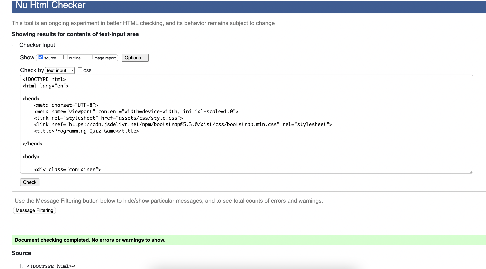

The W3C Markup Validation Service was used to validate the HTML of the website. Page pass with no errors no warnings to show.

### CSS Validation

CSS

- checked with css validator[W3 CSS Validation Image](assets/images/cssvalidationss.png "css validation") No CSS issues

The W3C Jigsaw CSS Validation Service was used to validate the CSS of the website. Page pass with no errors no warnings to show.

### JavaScript Validation

JS

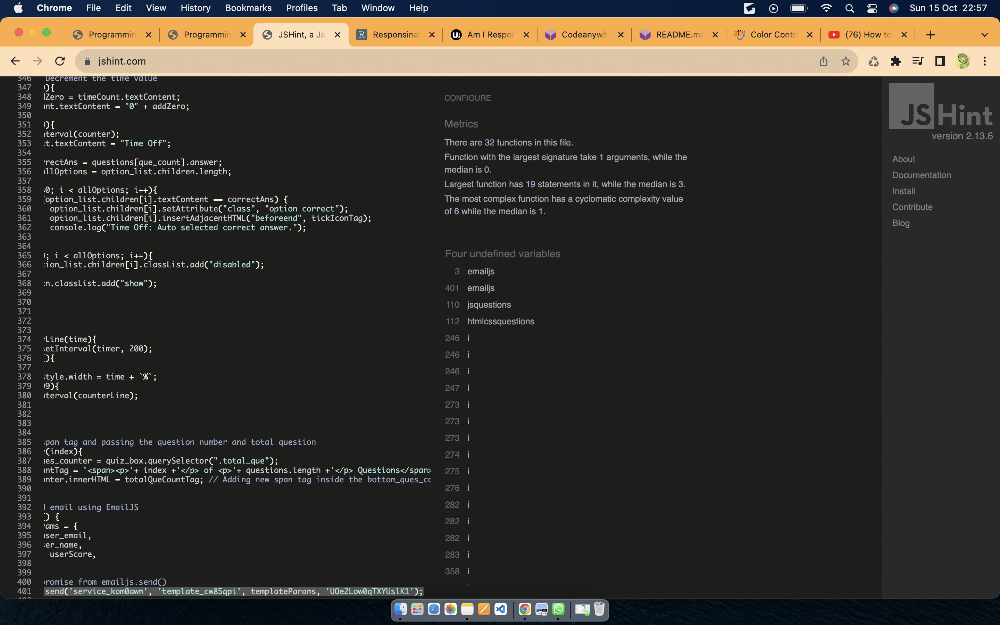

JSHint Static Code Analysis Tool for JavaScript was used to validate the Javascript file. There were 4 undefined variables found in the check . All are outside libraries which are connected directly to HTML file - script code and used .

**jsquestions.js**

JS Questions

**htmlcssquestions.js**

HTMLCSS Questions

### Contrast
- Checked all pages with [A11Y contrast checker](https://color.a11y.com/) Any contrast issues?
- No automated color contrast issues found on the webpage tested

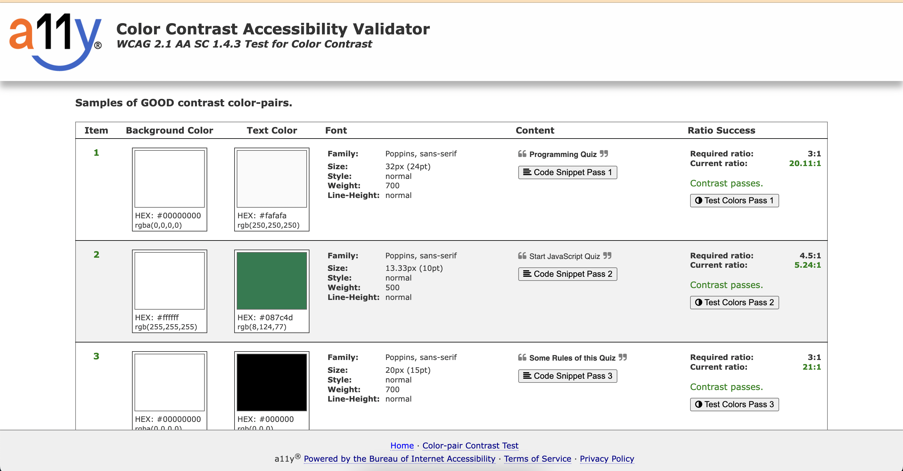

#### Browser Testing

The Website was tested on Google Chrome, Firefox, Microsoft Edge, Safari browsers with no issues noted.

#### Device Testing

The website was viewed on a variety of devices such as Desktop, Laptop, iPhone 8, iPhoneX and iPad to ensure responsiveness on various screen sizes. The website performed as intended. The responsive design was also checked using Chrome developer tools across multiple devices with structural integrity holding for the various sizes.

I also used the following websites to test responsiveness:

http://www.responsinator.com/?url=https%3A%2F%2Fmehatabpathan.github.io%2Fquiz-game%2F

https://ui.dev/amiresponsive?url=https://mehatabpathan.github.io/quiz-game/

#### Friends and Family User Testing

Friends and family members were asked to review the site and documentation to point out any bugs and/or user experience issues.

## Bugs

- After deploying the website I found out that the images were broken in the gallery page. This was due to absolute file paths. I fixed it by removing the initial slash and making the file paths relative.
- In the deployed version, the background images for the rules and get were not covering the whole section on tablets and larger screens. I fixed it by adding a height property to the sections affected.
- All font-awesome icons are loaded in svg format as font-awsome-kit is reducing the performance of the website

## Unsolved Bugs

- None.

### JavaScript

All Scripts checked with [JSHint](https://jshint.com/)

| **Sctipt** | **Any Errors?** | **Warnings?** | Other note worthy comments |
|:----------:|:---------------:|:-------------:|:--------------------------:|
| script.js | No Errors | No Warnings  | None |
| jsquestions.js | No Errors | No Warnings| None |
| htmlcssquestions.js | No Errors | No Warnings| None |

### Light House

[lighthouse ](assets/images/lighthouse.png "view light house")

## Deployment
Used GitHub Pages to bring the site to life [View The Site Here](https://mehatabpathan.github.io/quiz-game/)

### Local Development
The website was deployed using GitHub Pages by following these steps:

1. In the GitHub repository navigate to the Settings tab
2. On the left-hand menu select Pages
3. For the source select Branch: master
4. After the webpage refreshes automatically you will ses a ribbon on the top saying: "Your site is published at https://mehatabpathan.github.io/quiz-game/

#### How To Fork

To fork the depository:

1. Log in or sign up to <https://github.com/>
2. Go to the repository for this project https://github.com/mehatabpathan/quiz-game
3. Click the fork button in the top right corner

#### How To Clone

1. Log in or sign up to <https://github.com/>
2. Go to the repository for this project https://github.com/mehatabpathan/quiz-game
3. Click the code button, select whether you'd like to clone with HTTPS, SSH or GitHub CLI and copy the link shown.
4. Open the terminal in your code editor and change the current working directory to the location you want to use for the cloned directory.
5. Type 'Git Clone' into the terminal and then paste the link you copied in step 3. Press Enter.

## Technology used
- [HTML](https://www.w3schools.com/html/default.asp)
- [CSS](https://www.w3schools.com/css/default.asp)
- [JavaScript](https://www.w3schools.com/js/default.asp)
- [Fontawesome](https://fontawesome.com/)
- [Google Fonts](https://fonts.google.com/)
- [Github](https://github.com/)
- [Git](https://git-scm.com/)
- [MS Paint](https://apps.microsoft.com/store/detail/paint/9PCFS5B6T72H)
- [Github Desktop App](https://desktop.github.com/)
- [ui.dev Am I Responsive](https://ui.dev/amiresponsive)
- [Wire Frames](https://app.uizard.io/)

## Wireframes
### Start Page
[Start page wireframe](assets/images/startwf.png "view Start Page wire frame")

### Set of Rules
[Set of Rules wireframe](assets/images/rulewf.png "view Set of Rules wire frame")

### User Information Input
[ User Information Input wireframe](assets/images/infowf.png "view Set of Rules wire frame")

### Quiz Box
[Quiz Box wireframe](assets/images/quizboxwf.png " view Quiz Box wire frame")

### Score Card
[Score Card wireframe](assets/images/scorewf.png "view Score Card wire frame")

## Credits

### Content

All information provided was written by myself.

### Acknowledgments

I'd like to acknowledge the following people for helping me build this website.

- For my mentor, AntonioRodriquez for guiding me and helping me to improve elements of the site to make it more user friendly.
- For my tutor, Ed who helped me in the GitHub issue.
- for my Facilitator, Marko Tot who guided me with all the presentations that helped me to finish this project.

I used this presentation to improve my Readme

<https://docs.google.com/presentation/d/19_7r_To5bu7UjnZD87hrzWQi63Ij0YpaRH1XFnPZZe8/edit#slide=id.g1551aff15c5_1_0>

I used this mark up cheat sheet that I found on the slack community for clear guidance on how to create layouts for this readme file:

<https://github.com/tchapi/markdown-cheatsheet/blob/master/README.md>

Shields.io badges were created for readme.md file using the markup code from:
<https://shields.io/badges>

**Other Notible Mentions**
- [W3Schools](https://www.w3schools.com/) for inspiration on the loading CSS for use on quiz page and to find out uses for all type of varriables and inspiration to the questions. Invaluable tool so much knowledge for free its crazy.

- [Code Institute](https://codeinstitute.net/) for providing an excellent accelerated learning platform worth every penny.